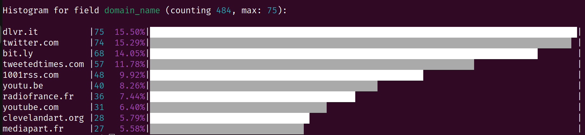
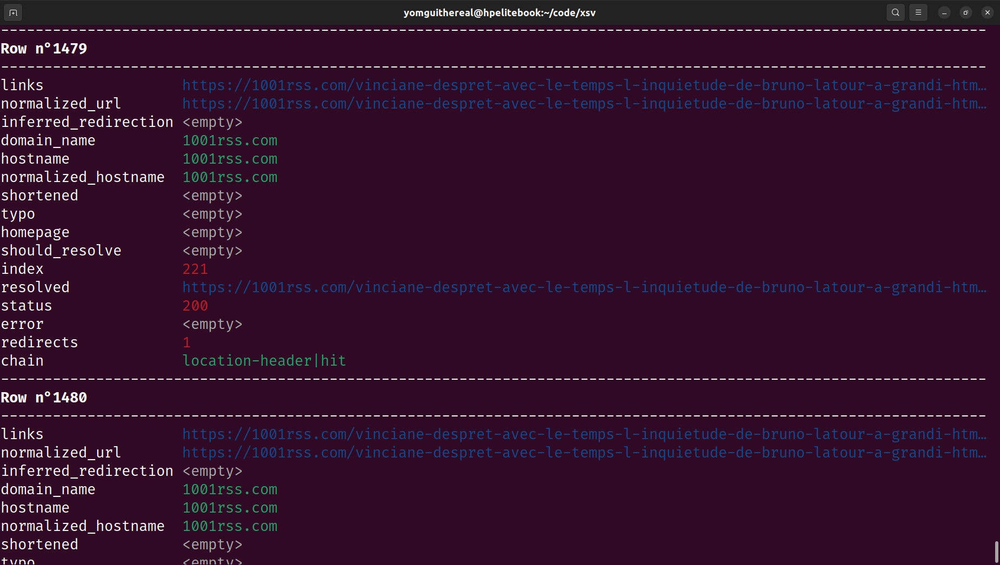
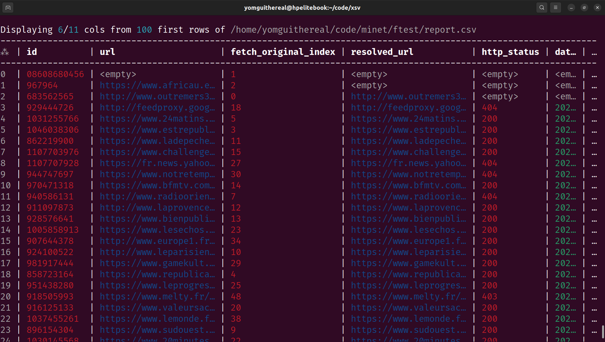

# The `xsv` Gazette

## Sept. 2023 Edition

A lot of shiny and exciting updates to `xsv` this september!

Install the newest version by running:

```bash
cargo install --git https://github.com/medialab/xsv.git --branch prod
```

### Summary

- [Dropping apply, enum & table](#dropping-apply-enum--table)
- [The xan scripting language and map/filter](#the-xan-scripting-language-and-mapfilter)
- [The shuffle command](#the-shuffle-command)
- [The glob command](#the-glob-command)
- [The xls command](#the-xls-command)
- [sort enhancements](#sort-enhancements)
- [The bins & hist command](#the-bins--hist-command)
- [frequency enhancements](#frequency-enhancements)
- [flatten revamp](#flatten-revamp)
- [The view command](#the-view-command)
- [The kway command](#the-kway-command)
- [Gzip native support](#gzip-native-support)
- [Faster explode](#faster-explode)

### Dropping `apply`, `enum` & `table`

Nobody seemed to use those commands anyway (even myself). RIP :'(.

### The `xan` scripting language and `map`/`filter`

Suuuure, the `casanova` CLI commands are fine, but python is hella slow. It would be nice if we could do some of the same stuff directly with `xsv` so we can rely on sweet sweet rust performance.

Well, `xsv` now packs a minimalistic dynamically typed scripting language (codename `xan`) than can be used in 2 new commands (only 2 for now, but you know I will add more lol):

* `xsv map`, adds a new column based on the value returned by an expression evaluated for each row of your CSV file.
* `xsv filter`, drops some rows if the value returned by the expression is falsy.

Wanna know how `xan` works, just type `xsv map --cheatsheet` for a quick rundown of the language and `xsv map --functions` for the exhaustive list of functions currently implemented.

Some examples of what you can do:

*Counting occurrences of a combination of columns in a file*

`xsv map 'concat(col1, "&", col2)' pair file.csv > xsv frequency -s pair`

*Filtering lines numerically*

`xsv filter 'lte(col1, 12)' file.csv`

*Filtering lines by checking if a file contains a substring*

`xsv map 'pathjoin("crawl/pages", filename) | read | contains(_, "jean-philippe")' -t 10`

The `-t/--threads` flag can be used to multithread the expression evaluation and go faster in some scenarios (typically when reading files from disk).

**N.B.**: Xan is a depressed enchanter from Baldur's Gate 1.

### The `shuffle` command

Need to shuffle (not sample) a large CSV file? The `shuffle` command is here for you.

It works by storing 2 `u64` numbers per line of the file so we don't spend too much memory.

If you need to work on a stream or something without random access, the `--in-memory` can also do the job but you will need to buffer the whole file into memory.

### The `glob` command

This new command creates a one-column CSV file containing the matches of a glob expression.

```bash
xsv glob '*.md' # will produce:
# path
# BENCHMARKS.md
# README.md
```

Let's be wild and pipe it into xsv filter?

```bash
xsv glob './**/*.html.gz' | xsv filter 'read(path) | contains(_, "coucou")' | xsv count
```

### The `xls` command

What if someone malicious hands you an Excel file? Huh? Where is your god now?

```
xsv xls file.xls
```

It even works with OpenOffice spreadsheets.

### `sort` enhancements

1. You can now check if a file is already sorted using the `--check` flag.
2. You can sometimes go faster using non-stable sorting with the `--unstable` flag.
3. You can go faster by spending more CPU resources and threads with the `--parallel` flag.

### The `bins` & `hist` command

Sorry [@MiguelLaura](https://github.com/MiguelLaura) but I dropped the `--pretty` flags in the `frequency` and `stats` command.

But don't worry, I recombobulated your code into two shiny new commands that we can compose better \o/.

First we have a `xsv bins` command that can be used to discretize continous values from a CSV column into bins of equal-width. It works quite similarly to the `xsv frequency` command and outputs a CSV file that is very much alike.

Then you can pipe the results or `xsv bins` or `xsv frequency` (or anything really, if you organize your data correctly) into `xsv hist` to display a stunning bar chart.

```bash
xsv frequency -s domain_name | xsv hist
```



Need to sort the histogram differently? Here you go, unix pipes to the rescue!

```bash
xsv frequency -s domain_name | xsv sort -s value |  xsv hist
```

### `frequency` enhancements

The `frequency` command can now work with a count `-t/--threshold` rather than a limit if you need to.

The command will also output a row counting all the remaining rows so you know what the top leaves out.

### `flatten` revamp

Flatten has been rewritten completely.



It has a `--condense` and a `--wrap` flag for convenience. It can also be piped to `less -r` easily.

And don't forget to taste the `--rainbow`!

### The `view` command

The `table` command was not very well loved, understandably. But we still need a nice way to previsualize CSV files from the comfort of the command line.

Please welcome the `view` command:



It only buffers 100 lines by default, and can easily be piped to `less -SR` (in which case don't forget the `-eC` flags, yes I know [@boogheta](https://github.com/boogheta), just create an alias already).

As with `flatten`, don't forget to taste the `--rainbow`!

### The `kway` command

Want to merge `k` already sorted files together in `O(k)` memory and `O(N)` time? Say no more and welcome the `kway` command into your heart!

### Gzip native support

No more pesky `gunzip -c | xsv`, `xsv` is now fully able to decompress files on the fly if their names end in `.gz` for you comfort.

Wanna know a secret? It seems to be faster than piping from `gunzip -c`!

### Faster explode

`xsv explode` is faster. That's it. That's the tweet.
