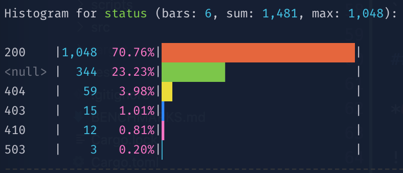
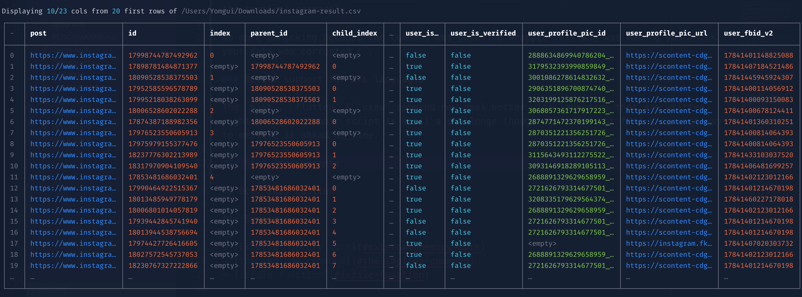

# The `xsv` Gazette

## Early Nov. 2023 Edition

So much *ææææææsthetic* improvements to `xsv` this november! Very wow!

And remember: `xsv` is just `pandas` for adults!

Install the newest version by running:

```bash
cargo install --git https://github.com/medialab/xsv.git --branch prod
```

### Summary

- [Fixed wrapping](#fixed-wrapping)
- [Better support for RTL languages](#better-support-for-rtl-languages)
- [hist improvements](#hist-improvements)
- [view improvements](#view-improvements)
- [Faster pseudo](#faster-pseudo)
- [enum is back](#enum-is-back)
- [transform command](#transform-command)
- [flatmap command](#flatmap-command)
- [New xan functions](#new-xan-functions)

### Fixed wrapping

All commands, notably `xsv flatten` with the `-w/--wrap` flag, now wrap text content in the terminal correctly.

No more panicking because the command was botching wrapped text and was making you think your data was corrupted :).

### Better support for RTL languages

The `hist`, `flatten` & `view` command now deal better with languages that are written right-to-left. Arabic script is still a challenge though and I did not find a correct way to measure it ahead of time.

### hist improvements

*Improved proportions*

More space was given to the labels to avoid ellision as much as possible. The numbers column will now only take the necessary space, up to a point.

*Support of absent field column*

Since the command was geared towards processing the output of the `frequency` and `bins` command, `hist` was expecting to find a "field" column taking the name of the represented column/category etc. It is possible to customize the name of this column using the `-f/--field` flag, but still, it was also a legitimate use case not to have this column altogether.

This means the command will now work in the absence of a "field" column, in which case you can always give a name to the represented values in the legend using the `--name` flag, if you need to.

*Rainbow support*

The `hist` command joins the very select club of commands having the `-R/--rainbow` flag.

Here, the flag will assign alternating colors to the bars. This can be nice for a small number of represented category to separate them visually, but will seem quite clownish on a large number of bars. Consider yourself warned. I won't take responsibility if you end up aesthetically injured by the output of the command.



<small><em>My eyes, it buuurns...</em></small>

*Simple output*

If you know you will write your bars to a text file or want a simpler output, you can now use the `-S/--simple` flag to use basic characters for the bars, that are easy to read without colors.

```txt
Histogram for status (bars: 6, sum: 1,481, max: 1,048):

200    |1,048  70.76%|━━━━━━━━━━━━━━━━━━━━━━━━━━━|
<null> |  344  23.23%|━━━━━━━━╸                  |
404    |   59   3.98%|━╸                         |
403    |   15   1.01%|╸                          |
410    |   12   0.81%|╸                          |
503    |    3   0.20%|╸                          |
```

### view improvements

*Overhauled look & feel*



The command has been rewritten to display solid borders, to be more clever regarding ideal column width inference and to show a mix of columns from the first & last columns (I blame [@bmaz](https://github.com/bmaz)) when available space is insufficient to display the whole table. Which is a perfect intro for the next section:

*Integrated pager flag*

You can now do `xsv view -p` instead of doing `xsv view -eC | less -SR` to automagically spawn a `less` pager with the correct settings for an extended view output.

*Experimental emojis sanitization*

It's not entirely possible to measure ahead of time the number of terminal columns an emoji will use when rendered. This means some emojis might break layout that rely on precise measurements for the characters such as the one used by the view command.

If this is an issue for you, the `view` command now accepts an experimental `-E` flag that will replace emojis with their usual name to ensure the terminal layout will not glitch.

For instance 👩‍👩‍👧 will be replaced as `:family_woman_woman_girl:`.

If this experiment is conclusive, the flag will be ported to `hist`, probably `flatten`, and why not as a `xan` function.

*Hiding the indices*

If you want more place and feel the index column on the left is useless to you, you can now hide it with the `-I/--hide-index` flag.

### Faster pseudo

`xsv pseudo` is faster. That's it. That's the tweet.

### enum is back

A simpler `enum` command, whose job is now only to prepend an index column to a CSV file, is back (I blame [@MiguelLaura](https://github.com/MiguelLaura)).

It can be useful when you know you are going to sort/shuffle/parallelize/join the file later on and need to find some info about the original order for instance.

```bash
# Prepending a 0-based index column
xsv enum file.csv

# Chosing the column name
xsv enum -c my_fancy_unicorn_index file.csv

# Starting from 1 like a R hipster
xsv enum -S 1 file.csv
```

Of course, if you are some kind of hipster, this is somewhat identical to:

```bash
xsv map 'val(%index)' index file.csv
```

but faster.

### transform command

`transform` is a new xan-powered command that is somewhat analogous to `map` but will not create a new column. Instead it will modify an existing column, that you can rename if you want.

Don't forget all xan commands come with the `--cheatsheet` flag, for a quick review of this very minimalistic script language, and the `--functions` for an exhaustive list of the supported functions.

For instance, if we have the following CSV file:

```
name,surname
John,davis
Mary,sue
```

And we want to uppercase the surname, we can run the following command:

```bash
xsv transform 'upper(surname)' surname -r upper_surname
```

to obtain:

```
name,upper_surname
John,DAVIS
Mary,SUE
```

### flatmap command

`flatmap` is yet another new xan-powered command that evaluates an expression for each row of a CSV file and will write 0 or any number of rows in the output by iterating over the expression's result.

Those rows will each have a new column containing a single item of the optionally iterable result of the evaluated expression. Or they can also replace the content of a column instead of adding a new one.

For instance, splitting a column by a character and emitting one new row per item in the splitted result is a typical example of `flatmap` (yes, I know about the `explode` command, which you certainly should use if you don't have weirder shit to do of course).

For instance, given this CSV file:

```txt
name,colors
John,blue
Mary,yellow|red
```

We can run the following command:

```bash
xsv flatmap 'split(colors, "|")' color -r colors
```

To obtain the following:

```txt
name,color
John,blue
Mary,yellow
Mary,red
```

And if you are a naughty person you can even use the `flatmap` command as a combined filter and map in one pass over the CSV file. Which means you can go from:

```txt
name,age
John Mayer,34
Mary Sue,45
```

to:

```txt
name,age,surname
Mary Sue,45,Sue
```

in this single crafty command:

```bash
xsv flatmap 'if(gte(age, 40), last(split(name, " ")))' surname
```

### New xan functions

*compact*

Filter out all falsey values from a list.

*unless*

A reverse `if` statement.

## Oct. 2023 Edition

### Summary

- [External memory sort](#external-memory-sort)
- [The implode command](#the-implode-command)
- [isfile function](#isfile-function)

### External memory sort

The `xsv sort` command is now able to sort very large files that would not fit into memory by relying on [external sorting](https://en.wikipedia.org/wiki/External_sorting), using the `-e/--external` flag.

You can also tweak the `--tmp-dir` flag if you want temporary files to be written in a different directory than the one currently holding the CSV file.

And if you want to allow more memory than the default 512MB, you can use the `-m/--memory-limit` flag.

### The implode command

The newly added implode command is the reverse of the `explode` one.

This means that the following file:

```csv
name,color
John,blue
John,yellow
Mary,red
```

Will be imploded as:

```csv
name,color
John,blue|yellow
Mary,red
```

Using:

```bash
xsv implode color '|' file.csv
```

### isfile function

An `isfile` function was added to the scripting language so you can assess whether the given path exists as a file on disk.

---

## Sept. 2023 Edition

A lot of shiny and exciting updates to `xsv` this september!

Install the newest version by running:

```bash
cargo install --git https://github.com/medialab/xsv.git --branch prod
```

### Summary

- [Dropping apply, enum & table](#dropping-apply-enum--table)
- [The xan scripting language and map/filter](#the-xan-scripting-language-and-mapfilter)
- [The shuffle command](#the-shuffle-command)
- [The glob command](#the-glob-command)
- [The xls command](#the-xls-command)
- [sort enhancements](#sort-enhancements)
- [The bins & hist command](#the-bins--hist-command)
- [frequency enhancements](#frequency-enhancements)
- [flatten revamp](#flatten-revamp)
- [The view command](#the-view-command)
- [The kway command](#the-kway-command)
- [Gzip native support](#gzip-native-support)
- [Faster explode](#faster-explode)
- [Stdin guard](#stdin-guard)

### Dropping `apply`, `enum` & `table`

Nobody seemed to use those commands anyway (even myself). RIP :'(.

### The `xan` scripting language and `map`/`filter`

Suuuure, the `casanova` CLI commands are fine, but python is hella slow. It would be nice if we could do some of the same stuff directly with `xsv` so we can rely on sweet sweet rust performance.

Well, `xsv` now packs a minimalistic dynamically typed scripting language (codename `xan`) than can be used in 2 new commands (only 2 for now, but you know I will add more lol):

* `xsv map`, adds a new column based on the value returned by an expression evaluated for each row of your CSV file.
* `xsv filter`, drops some rows if the value returned by the expression is falsy.

Wanna know how `xan` works, just type `xsv map --cheatsheet` for a quick rundown of the language and `xsv map --functions` for the exhaustive list of functions currently implemented.

Some examples of what you can do:

*Counting occurrences of a combination of columns in a file*

`xsv map 'concat(col1, "&", col2)' pair file.csv | xsv frequency -s pair`

*Filtering lines numerically*

`xsv filter 'lte(col1, 12)' file.csv`

*Filtering lines by checking if a file contains a substring*

`xsv map 'pathjoin("crawl/pages", filename) | read | contains(_, "jean-philippe")' -t 10`

The `-t/--threads` flag can be used to multithread the expression evaluation and go faster in some scenarios (typically when reading files from disk).

**N.B.**: Xan is a depressed enchanter from Baldur's Gate 1.

### The `shuffle` command

Need to shuffle (not sample) a large CSV file? The `shuffle` command is here for you.

It works by storing 2 `u64` numbers per line of the file so we don't spend too much memory.

If you need to work on a stream or something without random access, the `--in-memory` can also do the job but you will need to buffer the whole file into memory.

### The `glob` command

This new command creates a one-column CSV file containing the matches of a glob expression.

```bash
xsv glob '*.md' # will produce:
# path
# BENCHMARKS.md
# README.md
```

Let's be wild and pipe it into xsv filter?

```bash
xsv glob './**/*.html.gz' | xsv filter 'read(path) | contains(_, "coucou")' | xsv count
```

### The `xls` command

What if someone malicious hands you an Excel file? Huh? Where is your god now?

```
xsv xls file.xls
```

It even works with OpenOffice spreadsheets.

### `sort` enhancements

1. You can now check if a file is already sorted using the `--check` flag.
2. You can sometimes go faster using non-stable sorting with the `--unstable` flag.
3. You can go faster by spending more CPU resources and threads with the `--parallel` flag.

### The `bins` & `hist` command

Sorry [@MiguelLaura](https://github.com/MiguelLaura) but I dropped the `--pretty` flags in the `frequency` and `stats` command.

But don't worry, I recombobulated your code into two shiny new commands that we can compose better \o/.

First we have a `xsv bins` command that can be used to discretize continous values from a CSV column into bins of equal-width. It works quite similarly to the `xsv frequency` command and outputs a CSV file that is very much alike.

Then you can pipe the results or `xsv bins` or `xsv frequency` (or anything really, if you organize your data correctly) into `xsv hist` to display a stunning bar chart.

```bash
xsv frequency -s domain_name | xsv hist
```


Need to sort the histogram differently? Here you go, unix pipes to the rescue!

```bash
xsv frequency -s domain_name | xsv sort -s value |  xsv hist
```

### `frequency` enhancements

The `frequency` command can now work with a count `-t/--threshold` rather than a limit if you need to.

The command will also output a row counting all the remaining rows so you know what the top leaves out.

### `flatten` revamp

Flatten has been rewritten completely.


It has a `--condense` and a `--wrap` flag for convenience. It can also be piped to `less -r` easily.

And don't forget to taste the `--rainbow`!

### The `view` command

The `table` command was not very well loved, understandably. But we still need a nice way to previsualize CSV files from the comfort of the command line.

Please welcome the `view` command:


It only buffers 100 lines by default, and can easily be piped to `less -SR` (in which case don't forget the `-eC` flags, yes I know [@boogheta](https://github.com/boogheta), just create an alias already).

As with `flatten`, don't forget to taste the `--rainbow`!

### The `kway` command

Want to merge `k` already sorted files together in `O(k)` memory and `O(N)` time? Say no more and welcome the `kway` command into your heart!

### Gzip native support

No more pesky `gunzip -c | xsv`, `xsv` is now fully able to decompress files on the fly if their names end in `.gz` for you comfort.

Wanna know a secret? It seems to be faster than piping from `gunzip -c`!

### Faster explode

`xsv explode` is faster. That's it. That's the tweet.

### Stdin guard

`xsv` will now warn you if you did not give a file name and stdin is empty. This way it will not appear stuck forever waiting for some data that will never come.
